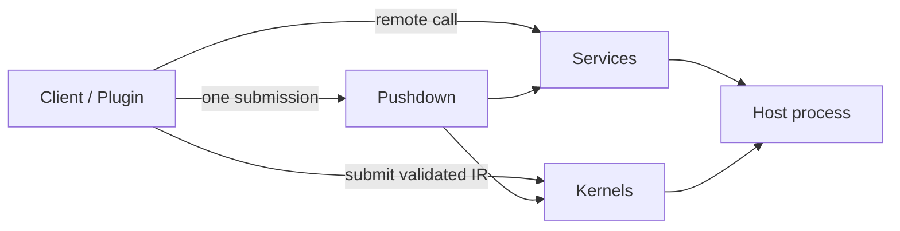

DotBoxD is a source-generated, contract-first .NET extension runtime. One C# contract can be used in
three ways:

New here? Install via [Getting started](/getting-started/), then work through the three
[Tutorials](/tutorials/) — the mode links below go straight to the deep-dive concepts.

- **[Services](/concepts/services/)** — the host implements a contract; clients call it remotely (RPC).
- **[Kernels](/concepts/kernels/)** — a client supplies validated logic the host runs safely inside a
  metered sandbox (restricted IR — an intermediate representation — never C#/IL/reflection).
- **[Pushdown](/concepts/pushdown/)** — a kernel composes the host's own services server-side, so many
  small remote calls collapse into one validated round-trip.



## Choosing a mode

Same contract, three delivery strategies. What differs is *where the author's logic runs* and
*what crosses the wire*:

| Mode | What it solves | Direction | Round-trips | Where the author's logic runs |
|------|----------------|-----------|-------------|-------------------------------|
| **[Services (RPC)](/concepts/services/)** | Typed request/response interop; no hand-written marshaling, and no runtime reflection on the hot path (it compiles ahead-of-time / AOT, so it runs on Unity's IL2CPP compiler). | client → host, response back | **1 per call** | host runs the hand-written implementation; the client invokes the typed proxy |
| **[Query / event pipeline](/concepts/event-pipelines/)** | Server-side filter + projection, so only the data you need is pushed to the plugin. | server → plugin, **one-way push** | **0** | `Where`/`Select` lower (compile down) to server-side sandboxed IR; only the `RunLocal` delegate is native plugin C# |
| **[Pushdown](/concepts/pushdown/)** | Collapse N per-entity calls into one server-side batch, next to the host's data. | client → host, **one submission** | **1, replacing N** | the author's batch method lowers to server-side sandboxed IR, looping the host's existing bindings |

Decision rules:

- **Services** — a one-shot request/response (fetch a price, compute a cart total). The interface is the
  single source of truth, so proxy and impl cannot drift.
- **Query (RunLocal)** — you react to a high-frequency server event stream but only need a subset/summary
  locally. Because the filter runs as validated, fuel-metered IR, you can accept that logic from untrusted
  plugins safely.
- **Pushdown** — a chatty `for each id: Kill(id)` loop that should be one batch. The server is never
  recompiled; the plugin ships the batch, which runs as verified, capability-gated, fuel-metered IR (real
  sandbox, not a trusted plugin).

Query and Pushdown **both** run author-supplied logic server-side as sandboxed
[kernels](/concepts/kernels/) — the only difference is push-to-plugin (Query) vs aggregate-and-return
(Pushdown). Services instead runs a hand-written host implementation, with no sandbox involved.

## Map

- **Why DotBoxD** — [the isolation-vs-latency dilemma, in three diagrams](/why-dotboxd/).
- **Getting started** — [install, first service, first kernel, pushdown quickstart](/getting-started/).
- **Tutorials** — end-to-end walkthroughs: [first Service](/tutorials/first-service/),
  [event pipelines (RunLocal)](/tutorials/event-pipeline-runlocal/), [Pushdown server extension](/tutorials/pushdown-server-extension/).
- **Examples** — [an annotated tour of the GameServer sample](/examples/gameserver-walkthrough/).
- **Concepts** — [Services](/concepts/services/), [Kernels](/concepts/kernels/),
  [Pushdown](/concepts/pushdown/), [Event pipelines](/concepts/event-pipelines/) (react to server events;
  `Hooks` vs `Subscriptions`, the stages, and all five terminals),
  [Host bindings](/concepts/host-bindings/) (policy-gated calls from kernels into host-owned APIs),
  [Channels & transports](/concepts/channels-transports/), and the kernel
  [runtime](/concepts/runtime/) (interpreted vs verified-IL, fuel/quotas/capabilities).
- **Security** — the threat model and the all-important
  [sandbox caveats](/security/sandbox-caveats/) (what is and isn't a boundary). See also the top-level
  [`SECURITY.md`](https://github.com/JKamsker/DotBoxD/blob/main/SECURITY.md).
- **Reference** — [`reference/diagnostics.md`](/reference/diagnostics/) (DBXS/DBXK codes),
  [`reference/schemas.md`](/reference/schemas/) (kernel/plugin JSON schemas).
- **Glossary** — [plain-language definitions of the core terms](/reference/glossary/) (IR, kernel, pushdown, fuel, capabilities).
- **API reference** — [generated from the source of every published package](/api/).
- **Specifications** — [the full kernel sandbox spec](https://github.com/JKamsker/DotBoxD/tree/main/docs/Specs)
  (IR language, type system, effects/capabilities, threat model, runtime).
- **Contributing** — [`contributing/migration-from-standalone-repos.md`](/contributing/migration-from-standalone-repos/):
  how this repo merges the former ShaRPC + Safe-IR projects and how to view their pre-merge history.
- **Channels (RPC) guide** — deeper reference for the channel layer the Services stack rides on
  (transports and codecs are standalone packages, usable independently): [quick-start](/channels/quick-start/),
  [API reference](/channels/api-reference/), [Unity integration](/channels/unity-integration/),
  [named-pipe](/channels/named-pipe-transport/)/[websocket](/channels/websocket-setup/) transports,
  [performance](/channels/performance/).

## Runnable Example

The maintained GameServer sample demonstrates service IPC (inter-process communication), event kernels, live settings, host
bindings, policy-gated execution, server extensions, and unload-on-disconnect:

```bash
dotnet run -c Release --project samples/GameServer/Examples.GameServer.Server/Examples.GameServer.Server.csproj
```
