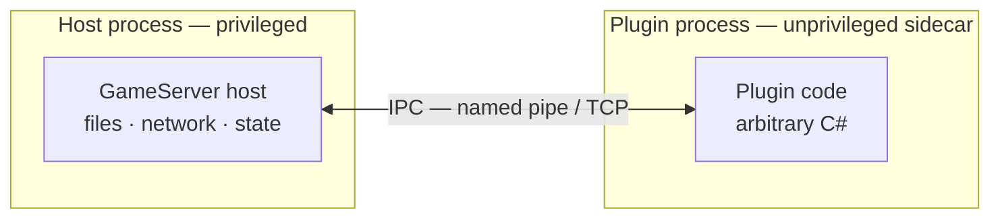
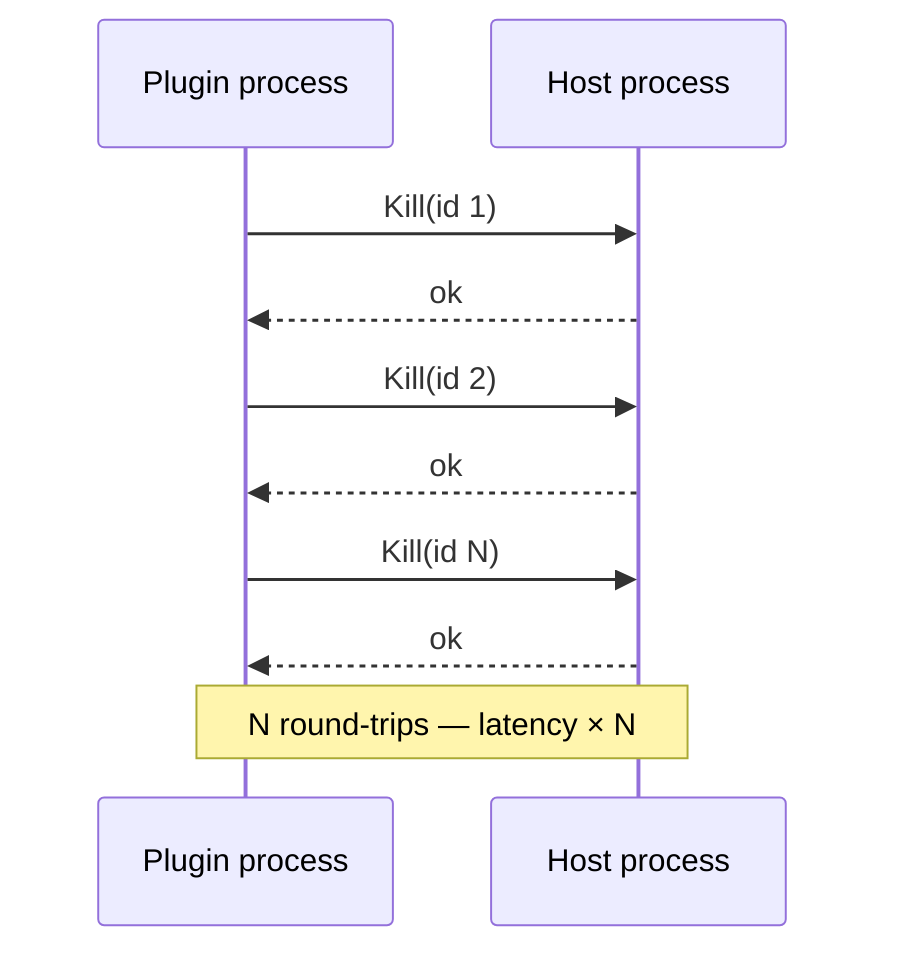
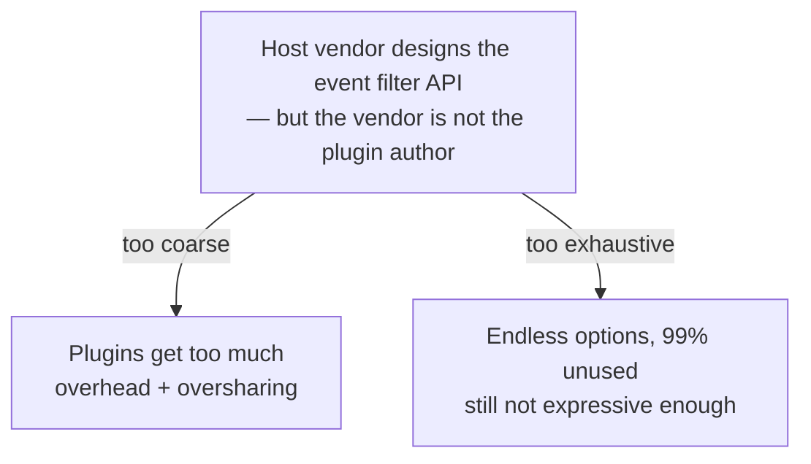
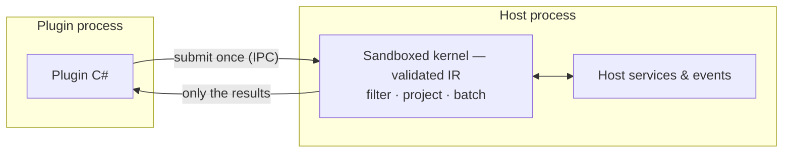

## The dilemma

In .NET you **cannot safely isolate arbitrary code inside your process**. AppDomain sandboxing is
gone, and `AssemblyLoadContext` is a loading feature, not a security boundary — loaded plugin code
can do anything your process can do.

What the OS *can* isolate is a **whole process**. So the safe architecture is a sidecar: the
plugin runs in its own unprivileged process, the host keeps the privileges (files, network, game
state) and exposes them deliberately, and the two talk over IPC.

## The first cost: round-trips

Safe — but now **every interaction crosses the process boundary**, even on the same machine.
A plugin that reacts to a high-frequency event stream, or calls `Kill(id)` in a loop, pays
serialization + transfer + scheduling *per call*:

## The second cost: the filter API

Events flow host → plugin, and each plugin only wants a slice. Someone has to filter — and the
host vendor, who is **not** the plugin author, must design that filter API blind:

- **Ship a few coarse filters**, and plugins still receive far too much — wasted serialization and
  round-trips, plus data crossing the boundary that never needed to leave the privileged process.
- **Try to anticipate every need**, and the API grows endless filter options — 99% never used, and
  still not expressive enough for the next plugin.

## The answer: keep the boundary, move the logic

DotBoxD keeps the process boundary — and gives plugin *logic* a safe way back into the host: a
**validated in-process sandbox**. Author code lowers at compile time to restricted IR that the
host validates, capability-gates, and fuel-meters before running. It is never loaded C#/IL, so the
host can accept it from an untrusted plugin — and it runs next to the host's data, without
per-item round-trips.

That also dissolves the filter dilemma: the **plugin author writes the filter**, as ordinary
`Where`/`Select` C# that lowers to sandboxed IR. The vendor no longer designs a bespoke filter
API — they publish events and capability-gate the sensitive properties, and only the plugin's own
projected result ever crosses the boundary.

In practice: [event pipelines](/concepts/event-pipelines/) push only server-side filtered,
projected events to the plugin (zero round-trips); [Pushdown](/concepts/pushdown/) collapses the
N-call loop into one sandboxed batch (one round-trip, replacing N). What stays request/response
uses generated [Services (RPC)](/concepts/services/) — typed proxies from one C# contract, no
hand-written marshaling.

## Everything else in the box

The rest of a plugin system is ceremony you should not have to build. DotBoxD ships it: transports
([named pipes](/channels/named-pipe-transport/), TCP, [WebSocket](/channels/websocket-setup/)),
codecs, generated proxies and dispatchers, event registries, [policies and
capabilities](/concepts/runtime/), and lifecycle such as unload-on-disconnect — see the
[GameServer example](/examples/gameserver-walkthrough/) for all of it working together.

Exact trust model and limits: [Sandbox caveats](/security/sandbox-caveats/).
