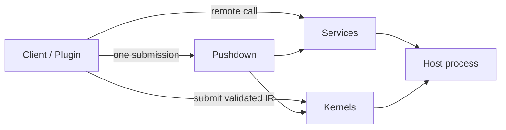

# DotBoxD documentation

DotBoxD is a source-generated, contract-first .NET extension runtime. One C# contract can be used in
three ways:

- **[Services](concepts/services.md)** — the host implements a contract; clients call it remotely (RPC).
- **[Kernels](concepts/kernels.md)** — a client supplies validated logic the host runs safely inside a
  metered sandbox (restricted IR — never C#/IL/reflection).
- **[Pushdown](concepts/pushdown.md)** — a kernel composes the host's own services server-side, so many
  small remote calls collapse into one validated round-trip.



## Map

- **Getting started** — [`getting-started/`](getting-started/): install, first service, first kernel,
  pushdown quickstart.
- **Concepts** — [`concepts/`](concepts/): services, kernels, pushdown, channels & transports, the
  kernel runtime (interpreted vs verified-IL, fuel/quotas/capabilities).
- **Security** — [`security/`](security/): the threat model and the all-important
  [sandbox caveats](security/sandbox-caveats.md) (what is and isn't a boundary). See also the top-level
  [`SECURITY.md`](../SECURITY.md).
- **Reference** — [`reference/diagnostics.md`](reference/diagnostics.md) (DBXS/DBXK codes),
  [`reference/schemas.md`](reference/schemas.md) (kernel/plugin JSON schemas).
- **Specifications** — [`Specs/`](Specs/): the full kernel sandbox spec (IR language, type system,
  effects/capabilities, threat model, runtime).
- **Contributing** — [`contributing/migration-from-standalone-repos.md`](contributing/migration-from-standalone-repos.md):
  how this repo merges the former ShaRPC + Safe-IR projects and how to view their pre-merge history.
- **Channels (legacy RPC docs)** — [`channels/`](channels/): quick-start, API reference, Unity
  integration, named-pipe/websocket transports, performance, design notes.

## Runnable Example

The maintained GameServer sample demonstrates service IPC, event kernels, live settings, host
bindings, policy-gated execution, server extensions, and unload-on-disconnect:

```bash
dotnet run -c Release --project samples/GameServer/Examples.GameServer.Server/Examples.GameServer.Server.csproj
```
